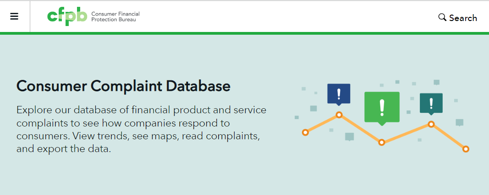
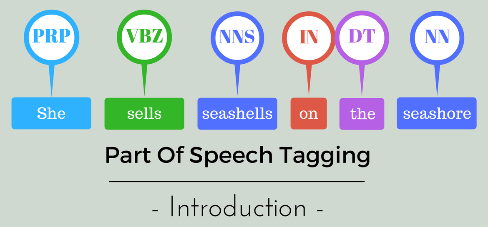

# Data Science Portfolio
---
## Machine learning

### Financial Complaint

The Consumer Complaint Database is a collection of complaints about consumer financial products and services that we sent to companies for response. Complaints can give us insights into problems people are experiencing in the marketplace and help us regulate consumer financial products and services under existing federal consumer financial laws, enforce those laws judiciously, and educate and empower consumers to make informed financial decisions.


[](https://github.com/sushantsur23/finance-complaint.git)

<center></center>

---
### POS Tagging

[](https://github.com/sushantsur23/POS_Tagging)

Tagging is a kind of classification that may be defined as the automatic assignment of description to the tokens.

Most of the POS tagging falls under Rule Base POS tagging, Stochastic POS tagging and Transformation based tagging.
One of the oldest techniques of tagging is rule-based POS tagging. Rule-based taggers use dictionary or lexicon for getting possible tags for tagging each word. If the word has more than one possible tag, then rule-based taggers use hand-written rules to identify the correct tag. Disambiguation can also be performed in rule-based tagging by analyzing the linguistic features of a word along with its preceding as well as following words. For example, suppose if the preceding word of a word is article then word must be a noun.


<center></center>
### Header 3

```js
// Javascript code with syntax highlighting.
var fun = function lang(l) {
  dateformat.i18n = require('./lang/' + l)
  return true;
}
```

```ruby
# Ruby code with syntax highlighting
GitHubPages::Dependencies.gems.each do |gem, version|
  s.add_dependency(gem, "= #{version}")
end
```

#### Header 4

*   This is an unordered list following a header.
*   This is an unordered list following a header.
*   This is an unordered list following a header.

##### Header 5

1.  This is an ordered list following a header.
2.  This is an ordered list following a header.
3.  This is an ordered list following a header.

###### Header 6

| head1        | head two          | three |
|:-------------|:------------------|:------|
| ok           | good swedish fish | nice  |
| out of stock | good and plenty   | nice  |
| ok           | good `oreos`      | hmm   |
| ok           | good `zoute` drop | yumm  |

### There's a horizontal rule below this.

* * *

### Here is an unordered list:

*   Item foo
*   Item bar
*   Item baz
*   Item zip

### And an ordered list:

1.  Item one
1.  Item two
1.  Item three
1.  Item four

### And a nested list:

- level 1 item
  - level 2 item
  - level 2 item
    - level 3 item
    - level 3 item
- level 1 item
  - level 2 item
  - level 2 item
  - level 2 item
- level 1 item
  - level 2 item
  - level 2 item
- level 1 item

### Small image


### Large image


### Definition lists can be used with HTML syntax.

<dl>
<dt>Name</dt>
<dd>Godzilla</dd>
<dt>Born</dt>
<dd>1952</dd>
<dt>Birthplace</dt>
<dd>Japan</dd>
<dt>Color</dt>
<dd>Green</dd>
</dl>

```
Long, single-line code blocks should not wrap. They should horizontally scroll if they are too long. This line should be long enough to demonstrate this.
```

```
The final element.
```
